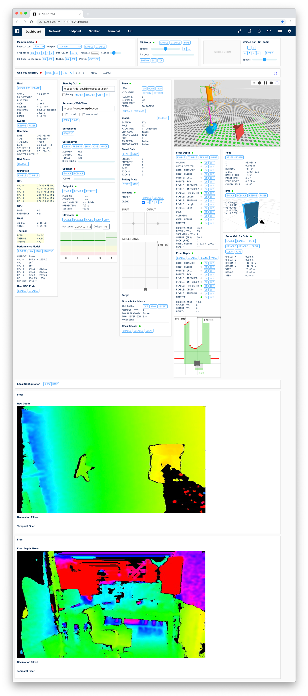

# Double 3 Developer SDK

Before accessing any developer features, your Double 3 will need to be [put into developer mode](docs/Developer%20Mode.md).

## Hardware

[Double 3](https://www.doublerobotics.com/double3.html) is powered by an Nvidia Jetson TX2-4GB System-on-Module connected to various built-in [sensors and devices](https://www.doublerobotics.com/tech-specs.html). The hardware is similar to an Nvidia [Jetson TX2 Dev Kit](https://developer.nvidia.com/embedded/jetson-tx2-developer-kit) with added peripherals.

## Custom Applications

You can write and deploy your own custom code on your D3. The D3 head runs Ubuntu 18.04 with the aarch64 architecture, so you can write code in any language that runs on that platform.

The core D3 software runs as a system service called `d3`. Your code will interact with this service by sending commands and receiving events. All commands and events are sent over a standard Unix domain socket. See more about [communicating with the D3 service](docs/Communication.md).

### HTML Applications

You can write an application in HTML and JavaScript and run it in the GUI module as a custom standby screen. You can set it to load on the D3 screen on boot. The GUI module runs an instance of Electron's BrowserWindow, which is essentially a Chromium web view window. Your application is not Electron-specific code, but just a standard web application. It has a preloaded global object that facilitates communication with the d3 service.

Most applications can be HTML applications. You have access to cameras, microphones, and the output of most sensors.

### Native Applications

You can also write applications in any other language that will run on the device, such as Python, C++, or Go. However, you will need to manage launching your application on boot. If you choose to do this, you can disable the default GUI from launching on boot.

With a native application, you can get access to raw sensor data, such as direct access to the RealSense D430 depth sensors. You could also create a user interface using any GUI toolkit that you prefer.

### In-Call Sidebar Apps

In-Call sidebar apps give developers the ability to add functionality to the driving experience in our desktop web driver client. [See more](docs/Sidebar%20Apps.md)

## Examples

1. [nodejs-basic](examples/nodejs-basic) - This example shows the most basic way to communicate with the d3 service in Node.js.
1. [python-basic](examples/python-basic) - This example shows the most basic way to communicate with the d3 service in Python.
1. [standby-basic](examples/standby-basic) - This example shows the most basic usage of displaying a page on screen, sending commands via DRDoubleSDK and processing incoming events.
1. [standby-camera](examples/standby-camera) - This example shows how to set the output of the camera as a v4l2 source and show it on the D3 screen with `getUserMedia`.
1. [standby-webrtc](examples/standby-webrtc) - This example shows how to orchestrate a WebRTC call using a custom standby screen and the native WebRTC implementation that takes advantage of the hardware h264 encoder.
1. [sidebar-basic](examples/sidebar-basic) - This example shows the basic functionality of an In-Call Sidebar App.

## Documentation

- [Glossary](docs/Glossary.md) describes key terms used throughout this documentation.
- [Release Notes](RELEASE%20NOTES.md) shows the history of new features.

### D3 API

- [API](docs/API.md) lists all commands and events.
- [Click-to-Drive](docs/Click-to-Drive.md) describes how to implement Click-to-Drive in your application.
- [Communication](docs/Communication.md) describes the command and event JSON packet structures.
- [Sidebar Apps](docs/Sidebar%20Apps.md) discusses In-Call Sidebar Apps.
- [Standby Apps](docs/Standby%20Apps.md) discusses Standby Apps.

### System Configuration

- [Console and Ubuntu Desktop](docs/Console%20and%20Ubuntu%20Desktop.md) describes how to access Ubuntu in standard ways.
- [Developer Mode](docs/Developer%20Mode.md) describes entering and exiting developer mode.
- [Performance Model](docs/Performance%20Model.md) describes how to control battery life vs high performance CPU and GPU.
- [Security](docs/Security.md) discusses security measures and how to maintain security when deploying.
- [Software Updates](docs/Software%20Updates.md) discusses installing software and updating the D3 software.
- [Startup](docs/Startup.md) describes how to customize what runs on boot.
- [USB Drive](docs/USB%20Drive.md) shows how to set up a USB flash drive for writing and executing code.
- [WPA2 Manual Config](docs/WPA2%20Manual%20Config.md) describes how to add a more complex WiFi network, such as EAP-TLS.

## Developer Mailing List

Get an email with release notes for each update by signing up for the [developer mailing list](https://docs.google.com/forms/d/e/1FAIpQLSdviSXqa2-YE6DecT3w9RJP2q-_2P922gK_iuV6HcizZ65SnQ/viewform).

## [D3 System Diagram](system-diagram.pdf)

## Monitor

The Monitor allows you to view and control all of your Double's features from a web interface hosted by an internal server on your D3. The Monitor is a great way to test the functionality of commands before writing any code.

Open the Monitor of your D3 in Chrome on your computer by visiting: http://YOUR_D3_IP:8080. You can find your D3's local IP by tapping the WiFi icon on the default standby screen. This tool uses the same [API commands](docs/API.md) that you can use in a custom application to communicate with the D3 system.

