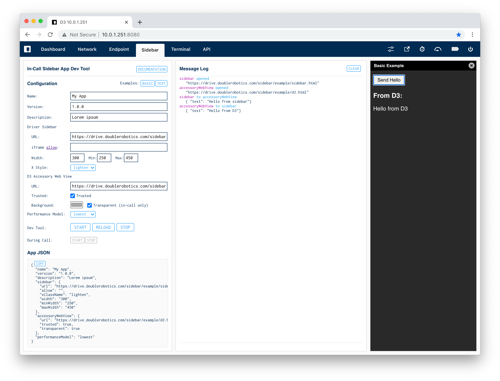

# In-Call Sidebar Apps

In-Call sidebar apps give developers the ability to add functionality to the driving experience in our desktop web driver client. The Developer Monitor has a tool for you to use while developing your in-call sidebar app.

Your app consists of a webpage for the driver's sidebar and a web page for the robot's accessory web view. You need to host these web pages on your own server or dev machine.

You can pass messages between these views via our built-in call infrastructure.

See the [basic sidebar app example](https://github.com/doublerobotics/d3-sdk/tree/master/examples/sidebar-basic).

### Sidebar Page

  - Displayed in sidebar iframe of desktop web driver client
  - Settable width (300px recommended) and optionally adjustable, height scales automatically
  - Include small JavaScript SDK for communication

There are built-in commands to for you to send messages back and forth.

Import the DRSidebarSDK to your sidebar web page:

    

Send message:

    DRSidebarSDK.sendMessage({ hello: "from sidebar" });

Receive message:

    DRSidebarSDK.onmessage = (message) => {
      // handle message
    };

### Accessory Page

  - Displayed fullscreen on D3 over incoming video
  - 768px x 1024px with 2x pixel ratio
  - Optional transparent background (useful to display graphics over driver's webcam feed)
  - Use standard on-board D3 API commands and events

The DRDoubleSDK JavaScript library (same as in the [standby-basic example](https://github.com/doublerobotics/d3-sdk/tree/master/examples/standby-basic)) is automatically loaded as a property of the window object.

Send message:

    DRDoubleSDK.sendCommand("endpoint.driverSidebar.sendMessage", {
      message: { hello: "from accessory" },
      targetOrigin: '*'
    });

To receive messages, you should subscribe to the `DREndpointModule.messageFromDriverSidebar` event:

    if ("DRDoubleSDK" in window) {
      DRDoubleSDK.on("event", (message) => {
        switch (message.class +"."+ message.key) {
          case "DREndpointModule.messageFromDriverSidebar": {
            if (message.data) {
              // handle data
            }
            break;
          }
        }
      });
      DRDoubleSDK.on("connect", () => {
        DRDoubleSDK.sendCommand("events.subscribe", {
          events: [
            "DREndpointModule.messageFromDriverSidebar"
          ]
        });
      });
    }

### JSON Configuration Example

Each app is defined by a JSON configuration object. This is the definition:

    {
      "name": "My App",
      "version": "1.0.0",
      "description": "Lorem ipsum",
      "sidebar": {
        "url": "https://drive.doublerobotics.com/sidebar/example/sidebar.html",
        "allow": "",
        "xClassName": "lighten",
        "width": "300",
        "minWidth": "250",
        "maxWidth": "450"
      },
      "accessoryWebView": {
        "url": "https://drive.doublerobotics.com/sidebar/example/d3.html",
        "trusted": true,
        "transparent": true
      },
      "performanceModel": "lowest"
    }

## Security

Do not allow the driver sidebar page to send just any D3 API command. While this may be an easy approach, you're opening up root access to any driver. This would be a security hole for your device, of course. You should create your own namespace of commands between your sidebar and accessory pages, then the accessory page should have the hard-coded D3 API commands.

## Running Apps

### Trigger App to Start

Use the `endpoint.driverSidebar.start` command on D3 during an active call to trigger the app to open in the driver client. Send your app's JSON configuration as the parameters.

You may want to trigger the app to open at the beginning of a call from your standby page or other application code by subscribing to the `DREndpointModule.sessionBegin` event.

### Stop App

The app will always have an X button in the top right. You can control its theme with the sidebar.xClassName property in the app's JSON configuration, with possible values of "lighten" and "darken". The user can click this at any time. The app may also be stopped when another app is launched because only one app can be running at a time.

Stop app from within sidebar:

    DRSidebarSDK.stop();

Intercept stopping by parent:

  DRSidebarSDK.interceptStop(() => {
    if (confirm("Are you sure?")) {
      DRSidebarSDK.stop();
    }
  });

Cancel your intercept by passing `null`:

    DRSidebarSDK.interceptStop(null);

### One-at-a-time

Only one app can be running at a time. Note that some default features use the app model too, such as Multi-Viewer. Any new app that is open automatically closes the currently running app.

### Minimum Performance Model

If your app uses any significant resources, you should set the performanceModel property of your JSON configuration to "high" or "highest". The core D3 code running during calls is highly optimized to run at the "lowest" performance model to save battery life. There is only a small margin of availaable performance for developer code.

### Sidebar iframe `allow` attribute

The `sidebar.allow` property value of your JSON configuration is set as the `allow` attribute of the `iframe` that the sidebar page is loaded into. Browser security blocks certain features in iframes by default, so you need to enable each feature that you will use. See the standard [Feature Policy](https://developer.mozilla.org/en-US/docs/Web/HTTP/Feature_Policy) documentation for more details.

### Sidebar-only

The accessory web view is technically not required. You could load just a plain web page in the sidebar iframe. However, you won't get the built-in way to pass messages to D3 or trigger D3 API commands.

### https in the Monitor > Sidebar dev tool

While you can use https for the sidebar page in the dev iframe, browser security [blocks certain features](https://developer.mozilla.org/en-US/docs/Web/Security/Secure_Contexts/features_restricted_to_secure_contexts) because the parent page is loaded over http. The [production driver client](https://drive.doublerobotics.com) is always loaded over https, so these restrictions do not apply.

### Sidebar Dev Tool

The Sidebar tab in the Developer Monitor is useful while creating and testing your sidebar code. It will simulate the in-call experience without launching a call each time and shows a log of your messages passing back and forth. You can also trigger it to start during a call, like you would do from your custom standby screen or other code running on D3.

