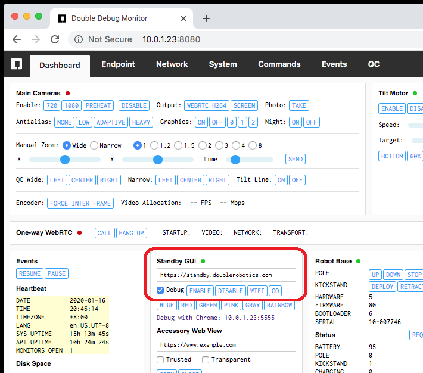

# Standby Apps

This page explains how to display a custom, interactive screen on your Double 3's touchscreen using HTML. 

Your standby app will run as a webpage with HTML and JavaScipt in an [Electron BrowserWindow](https://www.electronjs.org/docs/api/browser-window), which is essentially a standard Chrome window (Electron's `nodeIntegration` is off), except that it has the preloaded `window.DRDoubleSDK` object. 

Most applications can be HTML applications. You have access to cameras, microphones, and the output of most sensors.

## Examples

- [standby-basic](../examples/standby-basic)
- [standby-camera](../examples/standby-camera)
- [standby-webrtc](../examples/standby-webrtc)

## Communication via window.DRDoubleSDK

You can communicate with the D3 API via the `window.DRDoubleSDK` object that is preloaded and accessible by your page. These functions are available:

- `DRDoubleSDK.sendCommand(command, parameters)`
- `DRDoubleSDK.resetWatchdog()`
- `DRDoubleSDK.isConnected()`

These events are available:

- `connect`
- `disconnect`
- `event`

### Send Command

    window.DRDoubleSDK.sendCommand("base.requestStatus");`

### Subscribe to Events

    window.DRDoubleSDK.sendCommand("events.subscribe", {
        "events": [
            "DRBase.status",
            "DRNetwork.info"
        ]
    });`

### Receive Events

    DRDoubleSDK.on("event", (message) => {
        switch (message.class + "." + message.key) {
            case "DRBase.status":
                console.log("Battery:", message.data.battery);
                break;
            default:
                console.log(message);
                break;
        }
    });

## Important – Reset Watchdog

For maximum reliability, the system will automatically reload your page when you fail to reset the watchdog fast enough. This is in case your code locks up or begins running too slowly. If it fails several times in a row, it will restart Electron and try your page again. You must send this command faster than every 3 seconds:

    DRDoubleSDK.resetWatchdog();

This is the equivalent of sending `DRDoubleSDK.sendCommand("gui.watchdog.reset")`. You could also disable the watchdog functionality altogether with the `gui.watchdog.disallow` command, but this is not recommended.

## Launch Your Standby App

### Launch Temporarily

Upload your files to a web server. Type the address of your web server into the Standby GUI input field and click the "Go" button.



### Launch on Startup

You can set your URL to be the default standby screen with this command:

    api.setConfig
    {
      "key": "STANDBY_URL",
      "value": "https://d3.doublerobotics.com"
    }

Then reboot from the Monitor toolbar menu or send `system.reboot` or `system.restartService`. To reset it to the default, send:

    api.setConfig
    {
      "key": "STANDBY_URL",
      "value": null
    }

## Debugging with Chrome DevTools

In order to easily debug your web application as it runs on your D3, you can open the Chrome DevTools on your local machine and debug it remotely.  To do this, first mark the Debug checkbox on the Debug Monitor, then Disable and re-Enable the Standby GUI. Now, in the Standby GUI section of your Debug Monitor, a link will appear, which will look something like: ````http://YOUR_D3_IP:5555````.  Click the link to open the Chrome DevTools on your local machine.  

### DevTools Screencast Bug

There is a bug in Chrome DevTools while the "screencast" feature is on (the default). Rendering on the remote device (D3 screen) sometimes does not update. We recommend turning off the screencast - click the phone/tablet devices icon. You can still refresh your target page by using the key command (i.e. cmd + R).

## Adding More Functionality

As you can see from this example, your new standby screen does not just have to be static HTML.  It can be a fully functioning web application using JavaScript, and your code can interface with your Double.  To discover all of the functionality, you can read more about [Communicating with your Double](../../docs/Communication.md) and browse the [API Documentation](API.md) for a full list of commands and events.
